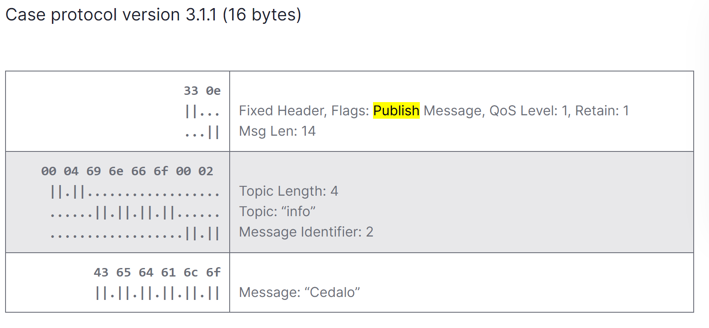

# MQTTプロトコルの作成

## 方向性
clientから作成していく、まずはサーバとつなげるためのコマンドを送信できるようにする

## 参考文献

[【連載MQTT5解説: 第3回】MQTTのコントロールパケット - aptpod Tech Blog](https://tech.aptpod.co.jp/entry/2024/02/02/100000)

[3 MQTT Control Packets](https://docs.solace.com/API/MQTT-311-Prtl-Conformance-Spec/MQTT%20Control%20Packets.htm)

[MQTT V3.1 プロトコル仕様](https://public.dhe.ibm.com/software/dw/jp/websphere/wmq/mqtt31_spec/mqtt-v3r1_ja.pdf)

PUBLISH

めちゃくちゃ詳しく書かれてる
[Init 1](https://codepr.github.io/posts/sol-mqtt-broker/)

任意のヘッダーファイルのコンパイル方法

ex :  gcc -o test_lib main/test_lib.c lib/MSB_LSB.c

